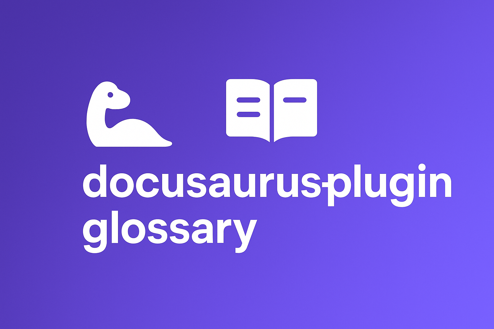

# docusaurus-plugin-glossary

[](https://www.npmjs.com/package/docusaurus-plugin-glossary)
[](https://github.com/mcclowes/docusaurus-plugin-glossary/actions/workflows/ci.yml)



A comprehensive Docusaurus plugin that provides glossary functionality with an auto-generated glossary page, searchable terms, and inline term tooltips.

> Compatibility: Fully compatible with Docusaurus v3 (MDX v3). If you were on a v2-era fork, please upgrade to the latest 2.x release of this plugin.

## Features

- **Auto-generated Glossary Page**: Displays all terms alphabetically with letter navigation
- **Search Functionality**: Real-time search across terms and definitions
- **GlossaryTerm Component**: Inline component for linking terms with tooltip previews
- **Automatic Term Detection**: Automatically detect and link glossary terms in markdown files with tooltips
- **Responsive Design**: Mobile-friendly UI with dark mode support
- **Related Terms**: Link between related glossary terms
- **Abbreviation Support**: Display full form of abbreviated terms
- **Customizable**: Configure glossary path and route

## Quick Start

1. **Install the plugin:**

   ```bash
   npm install docusaurus-plugin-glossary
   ```

2. **Use the preset in your `docusaurus.config.js`:**

   ```javascript
   module.exports = {
     presets: [
       [
         'docusaurus-plugin-glossary/preset',
         {
           // Glossary configuration
           glossary: {
             glossaryPath: 'glossary/glossary.json',
             routePath: '/glossary',
           },
           // Standard Docusaurus preset-classic options
           docs: {
             sidebarPath: './sidebars.js',
           },
           blog: {
             showReadingTime: true,
           },
           theme: {
             customCss: './src/css/custom.css',
           },
         },
       ],
     ],
   };
   ```

   **That's it!** The preset automatically configures the glossary plugin and remark plugin for you.

3. **Create your glossary file at `glossary/glossary.json`:**

   ```json
   {
     "description": "A collection of technical terms and their definitions",
     "terms": [
       {
         "term": "API",
         "abbreviation": "Application Programming Interface",
         "definition": "A set of rules and protocols that allows different software applications to communicate with each other.",
         "relatedTerms": ["REST", "GraphQL"]
       },
       {
         "term": "REST",
         "abbreviation": "Representational State Transfer",
         "definition": "An architectural style for designing networked applications.",
         "relatedTerms": ["API", "HTTP"]
       }
     ]
   }
   ```

4. **Start your dev server:**

   ```bash
   npm run start
   ```

5. **That's it!**
   - Visit `/glossary` to see your glossary page
   - Write markdown normally - terms will automatically be linked with tooltips
   - Use `<GlossaryTerm>` component in MDX for manual control

## Installation

### Install from npm (Recommended)

```bash
npm install docusaurus-plugin-glossary
```

## Usage Guide

### Step 1: Create Your Glossary File

Create a JSON file at `glossary/glossary.json` (or your configured path) in your Docusaurus site root:

```json
{
  "description": "A collection of technical terms and their definitions",
  "terms": [
    {
      "term": "API",
      "abbreviation": "Application Programming Interface",
      "definition": "A set of rules and protocols that allows different software applications to communicate with each other.",
      "relatedTerms": ["REST", "GraphQL"]
    },
    {
      "term": "REST",
      "abbreviation": "Representational State Transfer",
      "definition": "An architectural style for designing networked applications.",
      "relatedTerms": ["API", "HTTP"]
    }
  ]
}
```

**Required fields:**

- `term` (string): The glossary term name
- `definition` (string): The term's definition

**Optional fields:**

- `abbreviation` (string): The full form if the term is an abbreviation
- `relatedTerms` (string[]): Array of related term names that link to other glossary entries
- `id` (string): Custom ID for linking (auto-generated from term name if not provided)

### Step 2: Configure the Plugin

#### Option A: Using the Preset (Recommended)

The easiest way to configure the plugin is using the preset:

```javascript
module.exports = {
  presets: [
    [
      'docusaurus-plugin-glossary/preset',
      {
        glossary: {
          glossaryPath: 'glossary/glossary.json',
          routePath: '/glossary',
        },
        // All standard preset-classic options work here
        docs: {
          sidebarPath: './sidebars.js',
        },
        blog: {
          showReadingTime: true,
        },
        theme: {
          customCss: './src/css/custom.css',
        },
      },
    ],
  ],
};
```

The preset automatically configures both the glossary plugin and the remark plugin for automatic term detection.

#### Option B: Manual Configuration (Advanced)

If you need more control or want to use the plugin alongside the classic preset separately:

```javascript
const glossaryPlugin = require('docusaurus-plugin-glossary');

module.exports = {
  presets: [
    [
      '@docusaurus/preset-classic',
      {
        docs: {
          // Add the remark plugin to enable auto-linking in docs
          remarkPlugins: [
            glossaryPlugin.getRemarkPlugin(
              {
                glossaryPath: 'glossary/glossary.json',
                routePath: '/glossary',
              },
              { siteDir: __dirname }
            ),
          ],
        },
        pages: {
          // Add the remark plugin to enable auto-linking in pages
          remarkPlugins: [
            glossaryPlugin.getRemarkPlugin(
              {
                glossaryPath: 'glossary/glossary.json',
                routePath: '/glossary',
              },
              { siteDir: __dirname }
            ),
          ],
        },
      },
    ],
  ],
  plugins: [
    [
      'docusaurus-plugin-glossary',
      {
        glossaryPath: 'glossary/glossary.json',
        routePath: '/glossary',
      },
    ],
  ],
};
```

**Alternative: Using remarkPlugin directly**

You can also use the `remarkPlugin` export directly if you prefer:

```javascript
const glossaryPlugin = require('docusaurus-plugin-glossary');

module.exports = {
  presets: [
    [
      '@docusaurus/preset-classic',
      {
        docs: {
          remarkPlugins: [
            [
              glossaryPlugin.remarkPlugin,
              {
                glossaryPath: 'glossary/glossary.json',
                routePath: '/glossary',
                siteDir: __dirname,
              },
            ],
          ],
        },
      },
    ],
  ],
  plugins: [
    [
      'docusaurus-plugin-glossary',
      {
        glossaryPath: 'glossary/glossary.json',
        routePath: '/glossary',
      },
    ],
  ],
};
```

## How It Works

This plugin uses a **hybrid approach** combining build-time transformation and runtime enhancements, inspired by `docusaurus-plugin-image-zoom`:

### Build-Time: Remark Plugin

The remark plugin automatically detects glossary terms in your markdown and:

1. Transforms plain text terms into `<GlossaryTerm>` JSX components
2. Automatically injects the necessary import statement (`import GlossaryTerm from '@theme/GlossaryTerm';`)
3. This happens during the MDX compilation, before React renders anything

**No manual imports needed!** When you write:

```markdown
Our API uses REST principles.
```

The remark plugin transforms it to:

```jsx
import GlossaryTerm from '@theme/GlossaryTerm';

Our <GlossaryTerm term="API">API</GlossaryTerm> uses <GlossaryTerm term="REST">REST</GlossaryTerm> principles.
```

### Runtime: Client Modules

The plugin uses Docusaurus's `getClientModules()` API to automatically load client-side code on every page. This ensures:

- Glossary term functionality is available globally without configuration
- Components initialize correctly on each route change
- No performance impact from manual module loading

### Theme Components

The `GlossaryTerm` component is provided via the theme system (`@theme/GlossaryTerm`), making it:

- Available to all MDX files through automatic imports
- Swizzlable for custom styling and behavior
- Accessible to both the remark plugin and manual usage

## Docusaurus v3 Notes and Troubleshooting

- **MDX imports**: The plugin automatically injects `import GlossaryTerm from '@theme/GlossaryTerm';` when it auto-links a term. You can also use it manually in MDX:

  ```mdx
  import GlossaryTerm from '@theme/GlossaryTerm';

  Our <GlossaryTerm term="API" /> uses <GlossaryTerm term="REST">RESTful</GlossaryTerm> principles.
  ```

- **No tooltips or no auto-linking?**
  - Confirm you're on `@docusaurus/core@^3` and `react@^18`.
  - Ensure the plugin is listed in `plugins` AND the remark plugin is configured in your preset (see Step 2 above).
  - Visit `/glossary`. If the page or route fails to render, verify your `glossaryPath` file exists and contains a `terms` array.
  - Clear your Docusaurus cache with `npm run clear` and restart your dev server.
  - If you previously used an older version (v1.0.x), upgrade to the latest version; the plugin bundles the v3-compatible theme and remark integration.

- **Opting out of auto-linking**: Simply don't configure the remark plugin in your preset. You can still use the `<GlossaryTerm />` component manually where you want explicit control.

### Step 3: Use Glossary Terms in Your Content

#### Option A: Automatic Detection (Recommended)

With the remark plugin configured, glossary terms are **automatically detected and linked** in all your markdown files. Simply write your content normally:

```markdown
Our API uses REST principles to provide a simple interface.

This project supports webhooks for real-time notifications.
```

Terms like "API", "REST", and "webhooks" will automatically be:

- Detected if they're defined in your glossary
- Styled with a dotted underline
- Display a tooltip with the definition on hover
- Link to the full glossary page entry

**Limitations:**

- Only whole words are matched (respects word boundaries)
- Terms inside code blocks, links, or existing MDX components are **not** processed
- Matching is case-insensitive

#### Option B: Manual Component Usage

For more control or when automatic detection isn't sufficient, use the `GlossaryTerm` component in MDX files:

```jsx
import GlossaryTerm from '@theme/GlossaryTerm';

This website uses an <GlossaryTerm term="API">API</GlossaryTerm> to fetch data.

// Or with explicit definition (overrides glossary entry):
We use <GlossaryTerm term="REST" definition="Representational State Transfer" /> for our services.

// Or with children content:
Our <GlossaryTerm term="API" definition="Application Programming Interface">RESTful API</GlossaryTerm> is available.
```

**Component props:**

- `term` (required): The term name (used to look up definition from glossary)
- `definition` (optional): Override the definition from the glossary file
- `children` (optional): Custom text to display (defaults to term name)

### Step 4: Access the Glossary Page

The glossary page is automatically available at `/glossary` (or your configured `routePath`).

**Features:**

- Alphabetical grouping with letter navigation
- Real-time search across terms and definitions
- Clickable related terms
- Responsive design
- Dark mode support

**Add to navigation:**

To add the glossary to your navbar, update your `docusaurus.config.js`:

```javascript
module.exports = {
  themeConfig: {
    navbar: {
      items: [
        { to: '/glossary', label: 'Glossary', position: 'left' },
        // ... other items
      ],
    },
  },
};
```

## Configuration Options

| Option         | Type   | Default                    | Description                                           |
| -------------- | ------ | -------------------------- | ----------------------------------------------------- |
| `glossaryPath` | string | `'glossary/glossary.json'` | Path to glossary JSON file relative to site directory |
| `routePath`    | string | `'/glossary'`              | URL path for glossary page                            |

## Customization

### Styling

The plugin uses CSS modules for styling. You can override styles by:

1. Creating custom CSS in your site's `src/css/custom.css`:

```css
/* Override glossary term styles */
.glossaryTermWrapper .glossaryTerm {
  border-bottom-color: #your-color;
}

/* Override tooltip styles */
.glossaryTermWrapper .tooltip {
  background: #your-background;
}
```

2. For advanced customization, you can swizzle the components:

```bash
npm run swizzle docusaurus-plugin-glossary GlossaryPage -- --wrap
npm run swizzle docusaurus-plugin-glossary GlossaryTerm -- --wrap
```

### Adding to Navbar

To add the glossary to your navbar, update your `docusaurus.config.js`:

```javascript
themeConfig: {
  navbar: {
    items: [
      {to: '/glossary', label: 'Glossary', position: 'left'},
      // ... other items
    ],
  },
}
```

## Examples

See the [Usage Guide](#usage-guide) section above for complete examples. Here are additional examples:

### Complete Glossary Example

```json
{
  "description": "Technical terms used in our documentation",
  "terms": [
    {
      "term": "API",
      "abbreviation": "Application Programming Interface",
      "definition": "A set of rules and protocols that allows different software applications to communicate with each other.",
      "relatedTerms": ["REST", "GraphQL", "Webhook"]
    },
    {
      "term": "REST",
      "abbreviation": "Representational State Transfer",
      "definition": "An architectural style for designing networked applications.",
      "relatedTerms": ["API", "HTTP"]
    },
    {
      "term": "Webhook",
      "definition": "An HTTP callback that occurs when something happens; a simple event-notification via HTTP POST.",
      "relatedTerms": ["API", "HTTP"]
    }
  ]
}
```

### Writing Content with Automatic Detection

```markdown
---
title: API Documentation
---

# Getting Started with Our API

Our API uses RESTful principles to provide a simple and consistent interface.
Webhooks are supported for real-time event notifications.
```

The terms "API", "RESTful", and "Webhooks" will automatically be detected and linked if they're defined in your glossary.

### Using the Component in MDX

```mdx
---
title: API Documentation
---

import GlossaryTerm from '@theme/GlossaryTerm';

# Getting Started with Our API

Our <GlossaryTerm term="API" />
uses <GlossaryTerm term="REST">RESTful</GlossaryTerm>
principles to provide a simple and consistent interface.
```

## Development

This project is written in TypeScript and compiles to JavaScript. The source files are in `src/` and the compiled output goes to `dist/`.

### File Structure

```
docusaurus-plugin-glossary/
├── src/
│   ├── index.ts               # Main plugin entry point (TypeScript)
│   ├── client/
│   │   └── index.js           # Client module for runtime initialization
│   ├── components/
│   │   ├── GlossaryPage.js    # Glossary page component
│   │   ├── GlossaryPage.module.css
│   │   └── GlossaryPage.test.js
│   ├── remark/
│   │   └── glossary-terms.js  # Remark plugin for automatic term detection
│   └── theme/
│       └── GlossaryTerm/
│           ├── index.js       # Term component
│           ├── styles.module.css
│           └── index.test.js
├── dist/                      # Compiled output (generated by build)
│   ├── index.js               # Main plugin file (compiled from src/index.ts)
│   ├── client/                # Copied from src/client/
│   ├── components/            # Copied from src/components/
│   ├── remark/                # Copied from src/remark/
│   └── theme/                 # Copied from src/theme/
├── __tests__/
│   └── plugin.test.js         # Plugin lifecycle tests
├── examples/
│   └── docusaurus-v3/         # Example Docusaurus site
├── scripts/
│   ├── build.js               # Build script (TypeScript + copy files)
│   ├── watch.js               # Watch script for development
│   └── ...
└── package.json
```

### Building

The project uses TypeScript for the main plugin entry point (`src/index.ts`) and JavaScript for components. To build:

```bash
npm run build
```

This will:

1. Compile TypeScript (`src/index.ts`) to JavaScript (`dist/index.js`)
2. Copy JavaScript, CSS, and test files from `src/` to `dist/`

For development, use:

```bash
npm run watch
```

This watches for changes and automatically rebuilds.

### Plugin Lifecycle

The plugin follows Docusaurus plugin lifecycle hooks:

1. **getClientModules**: Returns client modules that load automatically on every page (provides runtime initialization)
2. **loadContent**: Reads glossary JSON file from the configured path
3. **contentLoaded**: Creates data files for components and remark plugin, adds glossary page route
4. **getThemePath**: Exposes theme components (`GlossaryTerm`)
5. **getPathsToWatch**: Watches glossary file for changes during development
6. **postBuild**: Optional post-build hook for additional processing

### Remark Plugin

The remark plugin (`remark/glossary-terms.js`) automatically detects glossary terms in markdown files and transforms them at build time. It:

- Scans text nodes for glossary terms (case-insensitive, whole word matching)
- Replaces matching terms with `<GlossaryTerm>` MDX components
- Automatically injects the necessary import statement (`import GlossaryTerm from '@theme/GlossaryTerm';`)
- Skips terms inside code blocks, links, or existing MDX components
- Respects word boundaries to avoid partial matches
- Handles plural forms (e.g., "API" matches "APIs")

## Troubleshooting

### Glossary page returns 404

- Ensure the plugin is properly configured in `docusaurus.config.js`
- Check that the `routePath` doesn't conflict with existing routes
- Run `npm run clear` to clear Docusaurus cache

### Glossary terms not showing

- Verify `glossary/glossary.json` exists at the correct path
- Check JSON syntax is valid
- Ensure `terms` array is properly formatted

### GlossaryTerm component not found

- Make sure you're importing from `@theme/GlossaryTerm`
- Try clearing cache with `npm run clear`
- Restart dev server

### Automatic term detection not working

- **IMPORTANT**: Ensure you have configured the remark plugin in your preset (see Configuration section above)
- Verify your glossary file exists at the configured `glossaryPath` and contains terms
- Check that terms in your content match the terms in your glossary (matching is case-insensitive but respects word boundaries)
- Try clearing cache with `npm run clear` and restarting the dev server
- Note that terms inside code blocks, links, or MDX components are not processed
- Make sure you've added the remark plugin to both `docs` and `pages` sections if you want auto-linking in both
- If you've manually configured the remark plugin, ensure `siteDir` points to the correct Docusaurus site directory

### Styles not applying

- Check for CSS conflicts in your custom CSS
- Ensure CSS modules are loading correctly
- Try clearing cache and rebuilding

## License

MIT

## Contributing

Contributions are welcome! Please see our [Contributing Guide](CONTRIBUTING.md) for details on how to get started.

## Changelog

See [CHANGELOG.md](CHANGELOG.md) for version history and release notes.

## Credits

Built for Docusaurus v3.x

## Technical Details

- **Language**: TypeScript (main plugin) + JavaScript (components)
- **Build System**: TypeScript compiler + custom build scripts
- **Package Entry Point**: `dist/index.js` (compiled from `src/index.ts`)
- **Exports**: Main plugin, remark plugin via package.json exports field
